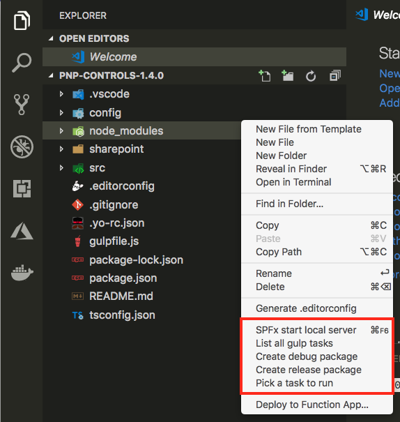

# SharePoint Framework Task Runner Extension for Visual Studio Code

This extension allows you to easily run SharePoint Framework tasks with a couple of mouse clicks. At the moment you can for example list all the available gulp tasks in your project, start the local development server and create debug or release solution packages or pick a task to run from the list of available tasks.

## Usage

When you have a SharePoint Framework project open in VSCode, right click in the explorer window and you should get the following actions in the context menu:

When you, for example, click on `SPFx start local server` it will execute the `gulp serve --nobrowser` command:

If you want to know which `gulp` tasks are available, you can click on the `List all gulp tasks` action and it will present you a list like this (this varies depending on the custom gulp tasks you might have defined):

You can also pick one of the available gulp tasks by clicking on `Pick a task to run`. This gives you a list of available tasks of which you can pick one to run (optionally you can choose or pass in arguments):

## Keyboard bindings

No keyboard bindings for the tasks have been defined. You can, of course, assign them yourself by opening the keyboard bindings in Visual Studio Code and search for `spfxTaskRunner`:

Here is an example of a custom defined keyboard binding for the `serve` command:

## Feedback and ideas

Feedback and ideas are always welcome. Please submit them via creating an issue in the project repository: [issue list](https://github.com/estruyf/vscode-spfx-task-runner/issues).